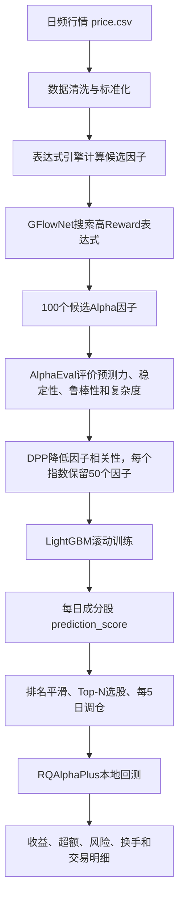

# GFlownet + AlphaEval 实验结果分析报告

> 报告日期：2026-07-29  
> 训练区间：2020-01-01—2023-12-31  
> 样本外预测与回测区间：2024-01-02—2026-07-17  
> 标签：`close(t+5) / close(t+1) - 1`，指数内个股收益减去信号日指数权重组合收益  
> 数据范围：本地 `price.csv`、历史指数成分与历史指数权重，不调用外部行情接口

### 0.1 这是什么项目

本项目研究的是一套**自动发现股票因子**的量化投资流程。它参考《基于GFlowNet和AlphaEval的分钟频因子挖掘筛选框架》，但当前阶段没有使用分钟数据，而是先在A股日频行情上完成可运行的缩小版复现。

这里的“因子”可以理解为一个每天给每只股票计算分数的公式。例如：

```text
cs_rank(ts_mean(close, 20))
```

这个表达式先计算每只股票过去20个交易日的平均收盘价，再在当天所有股票之间做横截面排名。项目会自动生成大量类似表达式，判断哪些表达式与未来收益有关，然后把筛选后的多个因子交给机器学习模型组合。

最终目标不是预测某只股票未来一定涨多少，而是回答一个更适合量化选股的问题：

> 在沪深300、中证500或中证1000的当期成分股中，未来5个交易日哪些股票相对指数内其他股票更可能表现较好？

模型每天为指数成分股输出一个 `prediction_score`。分数越高，股票的预期相对收益越高。回测策略每5个交易日根据平滑后的排名选择Top-N股票，并在RQAlphaPlus中模拟调仓、手续费、滑点、涨跌停和停牌等交易条件。

### 0.2 完整研究流水线



各阶段解决的问题和主要输出如下：

| 阶段 | 解决的问题 | 是否训练模型 | 主要输出 |
|---|---|---:|---|
| 数据准备 | 将原始行情变成可计算、无明显异常的日频面板 | 否 | `daily_price.pkl`、数据质量报告 |
| 表达式引擎 | 将字符串公式变成可执行的因子树 | 否 | 每个表达式的逐日逐股票因子值 |
| GFlowNet | 学习更倾向生成高质量Alpha表达式的概率分布 | 是 | `gflownet_best.pt`、`alpha_pool.csv` |
| AlphaEval | 对候选因子做多维评价和去冗余 | 否 | `alpha_eval_result.csv`、每个指数50个入选因子 |
| LightGBM | 学习多个因子与未来相对收益之间的非线性关系 | 是 | 滚动模型、`prediction_score.csv` |
| RQAlphaPlus | 检验预测信号在交易规则和成本下能否变成收益 | 否 | 净值、持仓、交易、风险指标和回测报告 |

需要特别区分：**GFlowNet和LightGBM训练的不是同一个东西。**GFlowNet学习“怎样生成因子公式”；LightGBM学习“怎样组合已经选出的因子给股票打分”；AlphaEval是规则化评价器，不是神经网络；RQAlphaPlus是回测引擎，也不参与模型训练。

### 0.3 数据、时间划分与防止未来信息泄漏

本轮实验使用本地日频行情，以及预先保存的历史指数成分和历史指数权重文件。不同日期只能使用当时已知的指数成分，不能拿今天的成分股名单回填历史，否则会产生幸存者偏差。

时间划分为：

| 用途 | 区间 | 可以做什么 |
|---|---|---|
| 训练期 | 2020-01-01—2023-12-31 | GFlowNet搜索、AlphaEval筛选、LightGBM初始训练和滚动训练历史窗口 |
| 样本外期 | 2024-01-02—2026-07-17 | 只生成预测并回测，用于检验模型对未见数据的泛化能力 |

未来收益标签定义为：

```text
future_return = close(t+5) / close(t+1) - 1
target_excess_return = 股票future_return - 指数成分权重组合future_return
```

使用 `t+1` 作为收益起点，是因为模型在交易日 `t` 收盘后获得完整日频数据，最早只能从下一交易日执行，不能假设按已经知道的 `t` 日收盘价成交。使用 `t+5` 作为终点，与每5个交易日调仓的持有周期对应。

样本外区间共有613个预测日，其中608个日期已经具备完整的未来5日标签。最后几个预测日因为未来行情尚不足，只能用于真实后续跟踪，不能纳入成熟样本的预测评价。

### 0.4 GFlowNet在本项目中做什么

GFlowNet全称Generative Flow Network，可把它理解为一个“会学习的因子公式生成器”。普通随机搜索会无差别生成大量无效公式；GFlowNet通过Reward反馈，逐渐提高高质量表达式被生成的概率，同时尽量保留多个不同解，而不是只寻找单一最优公式。

一次生成轨迹大致包括：选择特征、选择算子、选择窗口、组合子表达式并结束表达式。状态中记录表达式Token、表达式树、深度、算子数量和特征数量。Transformer Encoder输出下一步动作概率。

训练使用Trajectory Balance Loss：

```text
Loss = (logZ + ΣlogPF - logReward - ΣlogPB)²
```

- `PF`：从空表达式向最终表达式生成的前向概率；
- `PB`：从最终表达式退回前一状态的后向概率；
- `Reward`：表达式的金融评价；
- `logZ`：模型学习的全局归一化常数。

当前Reward主要综合RankIC、多头组合Information Ratio、覆盖率和风险惩罚。Reward越高，GFlowNet越应该增加该类表达式的生成概率。需要注意，GFlowNet的Loss衡量的是概率流平衡，并不等于因子预测误差，所以它不一定像普通监督学习Loss一样持续下降。

### 0.5 AlphaEval和DPP在本项目中做什么

GFlowNet生成的高Reward表达式仍可能高度相似，例如多个公式都在表达“低波动”“小市值”或“成交量放大”。如果把大量同类因子一起交给LightGBM，模型容易重复押注同一种风险。

AlphaEval从以下角度评价每个候选因子：

- 预测能力：IC、RankIC、ICIR和分组收益；
- 时间稳定性：滚动IC是否长期有效；
- 扰动鲁棒性：因子值加入小扰动后是否仍有效；
- 金融逻辑性：表达式长度、复杂度和嵌套深度；
- 覆盖率：每天有多少股票可以正常算出因子值；
- 多样性：不同因子是否高度相关。

DPP是一种多样性筛选方法。在分数相近时，它倾向于选择彼此相关性更低的因子。本轮先得到100个候选因子，再针对沪深300、中证500和中证1000分别选出50个因子。

### 0.6 五组实验比较

五组实验共享同一条研究流水线，主要差异在LightGBM学习目标：

| 实验 | 通俗解释 | 期望效果 |
|---|---|---|
| 旧L2基线 | 直接拟合未来5日超额收益数值 | 提供最基础的收益回归基准 |
| 截面Rank | 拟合股票在当天横截面中的收益名次 | 提高全截面排序相关性 |
| Huber | 仍预测超额收益，但降低极端收益对Loss的影响 | 提升稳健性和防守能力 |
| Top端加权 | 对未来收益最高20%的训练样本给予3倍权重 | 让模型更关注真正会进入Top-N的右尾股票 |
| LambdaRank | 直接学习排序，并重点优化列表头部 | 让高分股票的顺序更适合Top-N选股 |

这里有一个重要的公平性边界：最新四组实验使用相同数据、GFlowNet因子池、三指数AlphaEval结果和回测参数，因此适合直接比较LightGBM目标；旧L2基线使用的是全市场因子筛选，和新实验的差异不仅来自模型目标，也来自因子选择方式。

### 0.7 本报告的评价门槛与适用边界

本轮采用的候选晋级门槛是：

```text
Information Ratio >= 0.50
跟踪误差 <= 5%
年化换手 <= 10倍
超额最大回撤 <= 12%
至少两个自然年度取得正超额
```

这些门槛用于筛选“值得继续研究的指数增强候选”，不是对实盘收益的保证。当前结论还受到以下限制：

1. 源行情是否已经复权无法仅从数据质量报告确认；
2. 缺少行业和市值字段，GFlowNet风险惩罚没有真正生效；
3. 当前组合主要是平滑排名后的等权Top-N，并非严格的基准权重增强组合；
4. 回测不能完整复现真实市场冲击、容量、融券限制和所有成交细节；
5. 2024—2026只有约两年半样本外历史，不足以覆盖完整市场周期；
6. 本报告分析的是研究结果，不构成投资建议。

## 一、执行摘要

目前共有五组可比较实验：超额 L2 基线、截面 Rank 回归、Huber 超额收益回归、Top 端加权超额收益回归和 LambdaRank。最新四组实验的行情、GFlowNet 因子池、三指数 AlphaEval/DPP 结果和回测参数文件哈希完全一致，因此它们构成了一个质量较高的 LightGBM 目标函数对照实验。

主要结论如下：

1. **Top 端加权和 LambdaRank 是目前唯一产生整体正超额的两类模型。**三指数平均几何超额分别为 `+6.45%` 和 `+6.03%`；旧 L2、截面 Rank、Huber 分别为 `-11.49%`、`-12.68%`、`-8.31%`。
2. **LambdaRank 的综合可交易性最好。**三指数平均年化成交额换手为 `7.23 倍`，显著低于 Top 端加权的 `13.97 倍`，三指数累计交易成本合计约 `46.17 万元`，也是所有实验最低。
3. **Top 端加权的收益上限最高。**沪深300累计收益 `54.81%`、几何超额 `17.28%`、信息比率 `0.584`，均为目前最佳；中证1000的几何超额 `0.99%`，略高于 LambdaRank。
4. **中证500最适合 LambdaRank。**LambdaRank累计收益 `46.14%`、几何超额 `5.60%`，明显优于 Top 端加权的 `39.90%` 和 `1.09%`。
5. **截面 Rank 的 RankIC 虽然最高，但投资结果很差。**它把三指数样本外 RankIC 提升到 `0.020—0.038`，却让五分组高低收益差和 Top-N 平均超额转负。这证明普通 RankIC 与本项目的 Top-N 收益目标存在显著错位。
6. **Top 端模型具有明显行情状态依赖。**Top 端加权和 LambdaRank在2024年小盘踩踏阶段明显亏损，随后在2025—2026年取得主要超额，本质上偏向收益右尾和高弹性股票。
7. **目前仍没有任何“指数 × 模型”组合通过全部晋级门槛。**主要阻塞是跟踪误差过高、超额最大回撤过高，以及部分模型换手仍偏高。
8. **风险约束尚未真正生效。**数据质量报告显示没有行业和市值字段，GFlowNet Reward中的行业、市值风险惩罚实际上没有应用；当前等权 Top-N 组合也没有基准权重、行业和风格中性约束。

综合判断：**下一阶段应以 LambdaRank 为主模型、Top 端加权为收益增强模型、Huber 为防守模型，停止把截面 RankIC 当作单一晋级依据；同时必须引入组合层面的基准权重和风险约束。**

## 二、实验版本与可比性

| 报告名称 | 本地目录 | LightGBM目标 | 因子选择 | 作用 |
|---|---|---|---|---|
| 旧 L2 基线 | `results_rankic_topn/` | `excess_return + regression_l2` | 全市场AlphaEval因子 | P0冻结基线 |
| 截面Rank | `results_cross_sectional_rank/` | `target_cross_sectional_rank + regression_l2` | 三指数独立AlphaEval/DPP | 检验普通截面排序目标 |
| Huber | `results_excess_huber/` | `excess_return + huber` | 三指数独立AlphaEval/DPP | 稳健收益回归 |
| Top端加权 | `results_excess_top_weighted/` | `excess_return + regression_l2`，最高20%样本3倍权重 | 三指数独立AlphaEval/DPP | 强化收益右尾 |
| LambdaRank | `results_lambdarank/` | `lambdarank`，20档相关性标签，Top端2倍权重 | 三指数独立AlphaEval/DPP | 直接优化排序头部 |

### 2.1 受控实验检查

最新四个实验具有以下相同项：

- `colab_training_config.yaml` SHA256完全一致；
- `data_quality_report.json` SHA256完全一致；
- `alpha_pool.csv` SHA256均为 `6d880fb8...d4dc`；
- 三个指数的 `selected_factors.csv` SHA256完全一致；
- GFlowNet训练指标和全市场AlphaEval结果完全一致；
- 同一指数的回测参数文件完全一致；
- 预测区间、预测行数和股票覆盖数量完全一致。

因此，截面Rank、Huber、Top端加权和LambdaRank之间的绩效差异，主要可以归因于LightGBM目标函数和样本权重的变化。

旧L2基线与冻结目录 `experiments/baseline_v2_index_excess_l2_equal_weight/` 的22个模型、预测和回测文件哈希完全匹配，可以作为可信历史基线。不过，旧基线使用全市场因子筛选，而最新四组使用三指数独立筛选，因此“旧基线 vs 新实验”同时包含P2目标函数和P3因子选择的影响；“最新四组之间”才是严格的单变量对照。

## 三、数据与标签质量

### 3.1 行情预处理

数据质量报告显示：

| 项目 | 结果 |
|---|---:|
| 原始扫描行数 | 7,332,011 |
| 输出行数 | 7,332,011 |
| 删除重复行 | 0 |
| 删除无效行 | 0 |
| VWAP原始缺失 | 613 |
| OHLC异常值裁剪 | 每列约16,300条 |
| VWAP异常值裁剪 | 17,079条 |
| volume/amount异常值裁剪 | 各11,603条 |
| 复权处理 | 前复权 |
| 行业字段 | 不可用 |
| 市值字段 | 不可用 |

数据行数和日期覆盖满足训练要求，截面标准化后用于训练的字段没有残留缺失。但有两项重要限制：

1. 行业和市值字段不可用，使风险惩罚退化为1，研报要求的行业暴露、市值暴露控制尚未真实参与GFlowNet搜索。

### 3.2 指数标签质量

| 指数 | 标签行数 | 交易日 | 有效标签 | 可交易比例 | 平均权重覆盖 |
|---|---:|---:|---:|---:|---:|
| 沪深300 | 477,000 | 1,590 | 464,369 | 97.35% | 98.45% |
| 中证500 | 795,000 | 1,590 | 765,701 | 96.31% | 98.07% |
| 中证1000 | 1,590,000 | 1,590 | 1,527,244 | 96.05% | 97.78% |

标签采用历史成分和信号日指数权重，且排除了买入涨停、卖出跌停和停牌样本。三指数平均权重覆盖均高于95%门槛，PIT Universe和标签覆盖基本合格。

每个模型输出613个信号日，范围为2024-01-02—2026-07-16；其中608个日期具有成熟的`t+5/t+1`标签，最后5个信号日仅用于预测和回测，不应进入模型评价。

## 四、GFlowNet训练结果

### 4.1 训练概况

| 指标 | 结果 |
|---|---:|
| Epoch | 100 |
| 轨迹数 | 3,200 |
| 总训练时间 | 2.98小时 |
| 初始TB Loss | 256.43 |
| 最终TB Loss | 948.30 |
| 最低TB Loss | 111.90（Epoch 7） |
| Epoch平均Reward均值 | 0.0140 |
| 单Epoch最高Reward | 0.3101 |
| 轨迹Reward中位数 | 0.00216 |
| 轨迹Reward 95分位 | 0.0874 |
| 轨迹RankIC为正比例 | 24.84% |
| 轨迹平均覆盖率 | 93.35% |
| A100峰值显存 | 0.40GB |
| Reward耗时占比 | 99.70% |
| 最终缓存命中率 | 3.51% |

### 4.2 训练收敛判断

TB Loss没有稳定下降：最低点出现在第7个Epoch，随后长期大幅波动，最终Loss高于初始值。GFlowNet的on-policy采样分布会不断变化，因此Loss不必像监督学习一样单调，但当前波动幅度、较大的梯度范数和很低的正RankIC轨迹比例说明策略网络尚未形成稳定的高Reward生成分布。

当前因子池质量主要依靠“训练后大量采样 + Reward排序 + 覆盖率硬过滤”获得，而不是依靠一个明显收敛的生成策略。模型仍可用于生成候选表达式，但暂时不能把最终Loss或最后Epoch视为训练成功标志。

### 4.3 训练性能判断

- Reward计算占总训练时间99.70%，仍是绝对瓶颈；Transformer采样本身不是主要耗时。
- A100峰值显存只有约0.40GB，GPU利用空间很大。
- 时序算子确实使用了PyTorch GPU，但总Torch时序计算约1.58小时。
- 子表达式缓存最终命中率仅3.51%，说明100×32条轨迹之间的结构复用仍然有限，或缓存容量/淘汰策略未覆盖主要热点。

下一轮GFlowNet优化应优先处理Reward批量化、跨轨迹公共子树规范化、缓存键复用和Reward代理模型，而不是继续扩大Transformer。

## 五、Alpha因子池结果

### 5.1 因子池统计

| 指标 | 结果 |
|---|---:|
| 因子数量 | 100 |
| Reward最小/中位/最大 | 0.0112 / 0.0592 / 0.3083 |
| 样本内RankIC最小/中位/最大 | -0.0477 / 0.0327 / 0.0800 |
| LongIR中位数 | 0.740 |
| 最低观测覆盖率 | 81.26% |
| 最低有效交易日覆盖率 | 83.52% |
| 复杂度中位数 | 7 |
| 深度中位数 | 5 |

覆盖率惩罚和80%硬门槛已经发挥作用，所有进入因子池的表达式都满足最低覆盖要求，因低覆盖导致LightGBM或回测报错的风险明显降低。

### 5.2 高Reward因子特征

Reward最高的几个表达式大量使用：

- `volume × open`及其截面排序；
- `ts_rank`、`ts_std`、`ts_delay`、`ts_min/ts_max`；
- 价格与成交量之间的比值或乘积；
- 60日长窗口和5—20日短窗口组合。

最高Reward因子为：

```text
factor_001 = neg(abs(cs_rank(mul(volume, open))))
Reward = 0.3083
RankIC = 0.0800
LongIR = 2.853
Coverage = 100%
```

这类表达式容易带有规模、流动性和低波动暴露。由于行业和市值风险字段缺失，当前Reward无法区分“真正的个股Alpha”与“风格Beta”。后续风格归因很可能会发现成交额、市值、波动率和流动性是主要驱动。

## 六、AlphaEval与DPP结果

### 6.1 全市场AlphaEval

- 评价因子：100个；
- DPP选中：50个；
- 全体因子平均RankIC：0.0271；
- RankIC中位数：0.0327；
- 平均ICIR：1.473。

### 6.2 三指数独立筛选

| 指数 | 选中因子 | 选中因子平均RankIC | RankIC中位数 | 平均ICIR | ICIR中位数 | 平均Rank换手 |
|---|---:|---:|---:|---:|---:|---:|
| 沪深300 | 50 | 0.0118 | 0.0138 | 0.436 | 0.775 | 5.62% |
| 中证500 | 50 | 0.0173 | 0.0212 | 0.814 | 1.054 | 5.30% |
| 中证1000 | 50 | 0.0188 | 0.0241 | 1.069 | 1.433 | 5.92% |

中证500和中证1000的样本内因子质量明显高于沪深300，符合小盘股横截面Alpha更强的经验。但这并没有自然转化成更好的样本外增强收益，说明因子评价目标和组合目标仍需进一步对齐。

### 6.3 因子多样性不足

| 指数组合 | 共同因子 | 并集 | Jaccard相似度 |
|---|---:|---:|---:|
| 沪深300 vs 中证500 | 40 | 60 | 66.67% |
| 沪深300 vs 中证1000 | 41 | 59 | 69.49% |
| 中证500 vs 中证1000 | 48 | 52 | 92.31% |

P3的三指数独立AlphaEval流程已经正确执行，但中证500与中证1000最终只相差2个因子，Universe特异性仍然不足。原因可能包括候选池仅100个、因子表达式风格集中，以及DPP主要控制因子相关性而未控制风格暴露。

## 七、LightGBM样本外预测结果

下表使用真实指数超额收益重新评价所有模型，而不是直接采用模型内部目标值。

### 7.1 样本外RankIC

| 模型 | 沪深300 | 中证500 | 中证1000 |
|---|---:|---:|---:|
| 旧L2基线 | 0.0117 | 0.0113 | 0.0174 |
| 截面Rank | **0.0204** | **0.0332** | **0.0376** |
| Huber | 0.0078 | 0.0122 | 0.0226 |
| Top端加权 | -0.0149 | -0.0338 | -0.0429 |
| LambdaRank | -0.0318 | -0.0427 | -0.0572 |

普通截面Rank目标在RankIC意义上胜出，但Top端加权和LambdaRank的整体RankIC为负。这并不意味着后两者没有投资价值：它们的目标是提高收益头部的识别能力，而不是正确排序所有股票。

### 7.2 五分组和Top-N收益

单位为每个`t+5/t+1`区间的基点（bp）：

| 模型 | 指数 | Q5-Q1 | Top-N平均超额 |
|---|---|---:|---:|
| 旧L2 | 沪深300 / 中证500 / 中证1000 | -4.5 / -3.1 / -10.9 | -3.8 / -5.2 / -10.8 |
| 截面Rank | 沪深300 / 中证500 / 中证1000 | -26.0 / -21.1 / -15.9 | -14.4 / -14.8 / -15.2 |
| Huber | 沪深300 / 中证500 / 中证1000 | -13.7 / -7.9 / -5.1 | -8.1 / -7.0 / -6.0 |
| Top端加权 | 沪深300 / 中证500 / 中证1000 | **+24.8 / +6.1 / +1.7** | +13.8 / -5.1 / -1.6 |
| LambdaRank | 沪深300 / 中证500 / 中证1000 | **+27.3 / +18.0 / +4.6** | **+15.9 / +3.7 / -4.0** |

这一结果揭示了当前最重要的方法论结论：

```text
全截面RankIC高，不代表Top-N平均收益高；
全截面RankIC为负，也不代表收益右尾无法被识别。
```

截面Rank模型主要学到了低波动和较小下行风险。最高分组的收益中位数略好，但它同时错过大量极端上涨股票，因此均值收益反而更低。Top端加权和LambdaRank则主动牺牲普通股票的排序，换取对收益右尾的暴露。

### 7.3 模型族与互补性

模型预测大致分成两个家族：

1. **防守族：旧L2、截面Rank、Huber。**Huber与旧L2的日度排名相关性约0.72—0.83，Top-N重合约63%—68%。
2. **右尾族：Top端加权、LambdaRank。**两者日度排名相关性约0.69—0.76，Top-N重合约59%—63%。

截面Rank与LambdaRank的相关性为负：沪深300、中证500、中证1000分别约为 `-0.32`、`-0.50`、`-0.56`，Top-N重合只有约14%、8%、7%。这意味着防守模型与右尾模型具有较强组合价值，可以通过集成降低单一行情状态风险。

## 八、总体回测结果

所有回测均使用：初始资金1000万元、5个交易日调仓、0.001滑点、98%资金使用率、`[0.5, 0.3, 0.2]`排名平滑、持仓缓冲、25%最大替换比例和10日最短持有期。

### 8.1 沪深300增强

| 模型 | 总收益 | 年化收益 | 几何超额 | 信息比率 | 跟踪误差 | 最大回撤 | 超额最大回撤 | 年化成交额换手 |
|---|---:|---:|---:|---:|---:|---:|---:|---:|
| 旧L2 | 17.17% | 6.44% | -11.23% | -0.622 | 8.06% | 21.38% | 16.00% | 21.10x |
| 截面Rank | 17.42% | 6.53% | -11.04% | -0.589 | 9.76% | 17.70% | 21.34% | 15.68x |
| Huber | 28.15% | 10.26% | -2.92% | -0.171 | 7.90% | 18.04% | 12.30% | 20.05x |
| Top端加权 | **54.81%** | **18.79%** | **17.28%** | **0.584** | 14.73% | 26.62% | 18.42% | 14.13x |
| LambdaRank | 48.15% | 16.75% | 12.23% | 0.445 | 16.04% | 27.26% | 20.78% | **7.09x** |

沪深300上Top端加权是收益和IR最好的模型，也是所有15个“模型×指数”组合中唯一达到IR≥0.5的结果。LambdaRank收益略低，但换手只有Top端加权的一半。

### 8.2 中证500增强

| 模型 | 总收益 | 年化收益 | 几何超额 | 信息比率 | 跟踪误差 | 最大回撤 | 超额最大回撤 | 年化成交额换手 |
|---|---:|---:|---:|---:|---:|---:|---:|---:|
| 旧L2 | 29.14% | 10.60% | -6.69% | -0.354 | 9.10% | 19.85% | 18.29% | 20.20x |
| 截面Rank | 21.92% | 8.12% | -11.90% | -0.503 | 13.10% | 16.53% | 29.33% | 16.20x |
| Huber | 26.85% | 9.82% | -8.34% | -0.435 | 9.07% | 21.16% | 19.63% | 20.25x |
| Top端加权 | 39.90% | 14.15% | 1.09% | 0.201 | 10.32% | 28.30% | 15.31% | 13.24x |
| LambdaRank | **46.14%** | **16.12%** | **5.60%** | **0.382** | 11.52% | 28.81% | **13.91%** | **6.85x** |

中证500上LambdaRank全面优于Top端加权，是当前最明确的候选模型。但跟踪误差11.52%和最大回撤28.81%仍然过高。

### 8.3 中证1000增强

| 模型 | 总收益 | 年化收益 | 几何超额 | 信息比率 | 跟踪误差 | 最大回撤 | 超额最大回撤 | 年化成交额换手 |
|---|---:|---:|---:|---:|---:|---:|---:|---:|
| 旧L2 | 1.60% | 0.63% | -16.55% | -0.777 | 10.08% | 29.37% | 21.57% | 21.04x |
| 截面Rank | 3.38% | 1.32% | -15.10% | -0.575 | 13.92% | 27.05% | 26.66% | 15.04x |
| Huber | 5.13% | 1.99% | -13.66% | -0.632 | 10.17% | 28.43% | 18.76% | 20.81x |
| Top端加权 | **22.96%** | **8.49%** | **0.99%** | 0.194 | **9.95%** | **32.02%** | **15.47%** | 14.54x |
| LambdaRank | 22.07% | 8.17% | 0.26% | **0.200** | 10.89% | 33.01% | 20.04% | **7.75x** |

中证1000上Top端加权和LambdaRank接近。Top端加权收益、跟踪误差和超额回撤较好；LambdaRank换手和交易成本明显更低。两者都只取得很弱的正超额，尚不足以认为模型在中证1000上形成稳定优势。

### 8.4 跨指数综合比较

| 模型 | 三指数平均总收益 | 三指数平均几何超额 | 平均IR | 平均跟踪误差 | 平均超额最大回撤 | 平均年化成交额换手 | 三指数交易成本合计 |
|---|---:|---:|---:|---:|---:|---:|---:|
| 旧L2 | 15.97% | -11.49% | -0.584 | 9.08% | 18.62% | 20.78x | 189.65万元 |
| 截面Rank | 14.24% | -12.68% | -0.556 | 12.26% | 25.78% | 15.64x | 98.03万元 |
| Huber | 20.04% | -8.31% | -0.413 | 9.04% | 16.90% | 20.37x | 123.16万元 |
| Top端加权 | **39.23%** | **6.45%** | 0.327 | 11.66% | **16.40%** | 13.97x | 84.06万元 |
| LambdaRank | 38.79% | 6.03% | **0.342** | 12.82% | 18.24% | **7.23x** | **46.17万元** |

这里的“三指数平均”只用于横向实验筛选，不代表可投资组合的真实组合收益。

## 九、年度与行情状态分析

### 9.1 三指数平均年度超额

| 模型 | 2024 | 2025 | 2026截至7月 |
|---|---:|---:|---:|
| 旧L2 | -3.74% | -4.95% | -3.81% |
| 截面Rank | **+1.39%** | -7.31% | -7.56% |
| Huber | -0.80% | -4.52% | -3.58% |
| Top端加权 | **-9.13%** | **+6.27%** | **+9.35%** |
| LambdaRank | -6.74% | **+6.43%** | +6.30% |

结果呈现非常强的风格轮动：

- 2024年防守型截面Rank最好，Top端模型明显落后；
- 2025—2026年Top端模型显著领先，截面Rank持续落后；
- Top端模型的累计正超额几乎全部来自2025—2026年；
- 这不是稳定的跨状态Alpha，而是明显的右尾/弹性风格暴露。

### 9.2 小盘踩踏压力测试

压力区间为2024-01-05—2024-02-08：

| 模型 | 沪深300 | 中证500 | 中证1000 |
|---|---:|---:|---:|
| 旧L2 | +0.30% | -3.09% | -13.93% |
| 截面Rank | **+4.01%** | **-1.26%** | **-11.98%** |
| Huber | +2.88% | -2.90% | -13.89% |
| Top端加权 | -5.42% | -6.49% | -14.79% |
| LambdaRank | -5.86% | -7.11% | -14.09% |

截面Rank确实具有防守价值；Top端加权和LambdaRank在流动性冲击与小盘踩踏中损失较大。若直接把LambdaRank作为单一实盘模型，会暴露明显的行情状态风险。

## 十、换手率与交易成本

### 10.1 优化效果

LambdaRank的三指数年化成交额换手为 `7.09x / 6.85x / 7.75x`，全部低于10倍目标；它也是唯一在三个指数上都通过换手门槛的实验。

Top端加权的换手为 `14.13x / 13.24x / 14.54x`，比旧基线下降约30%，但仍高于目标。Huber的换手接近旧基线，说明仅改变回归损失不足以降低组合调整频率。

## 十一、风险与跟踪误差

当前所有模型的跟踪误差都高于5%目标：

- 最低值为Huber沪深300的7.90%；
- Top端加权约9.95%—14.73%；
- LambdaRank约10.89%—16.04%。

主要原因不是模型本身，而是组合构建：

1. 组合采用Top-N等权，而指数采用自由流通市值权重；
2. 没有行业中性和风格中性；
3. 没有个股相对基准主动权重上限；
4. GFlowNet风险惩罚缺少行业和市值输入；
5. 收益右尾模型会集中持有高弹性、高波动股票。

因此，下一轮继续调整LightGBM参数无法单独把跟踪误差压到5%。必须增加组合优化层：

```text
目标：最大化预测Alpha - 风险厌恶系数 × 主动风险 - 交易成本

约束：
- 个股权重围绕基准权重偏离；
- 行业主动权重限制；
- 市值、波动率、流动性等风格暴露限制；
- 单票上限与最小持仓；
- 预估跟踪误差上限；
- 单次换手预算。
```

## 十二、晋级门槛检查

当前门槛为：IR≥0.5、跟踪误差≤5%、年化成交额换手≤10倍、超额最大回撤≤12%、至少两年Q5-Q1为正。

| 模型/指数 | IR | TE | 换手 | 超额回撤 | Q5-Q1年度 | 全部通过 |
|---|---|---|---|---|---|---|
| Top端加权/沪深300 | 通过 | 失败 | 失败 | 失败 | 通过 | 否 |
| Top端加权/中证500 | 失败 | 失败 | 失败 | 失败 | 通过 | 否 |
| Top端加权/中证1000 | 失败 | 失败 | 失败 | 失败 | 通过 | 否 |
| LambdaRank/沪深300 | 失败 | 失败 | 通过 | 失败 | 通过 | 否 |
| LambdaRank/中证500 | 失败 | 失败 | 通过 | 失败 | 通过 | 否 |
| LambdaRank/中证1000 | 失败 | 失败 | 通过 | 失败 | 通过 | 否 |

其他三类模型也没有任何组合通过全部门槛。当前结果应视为研究候选，不应标记为可上线策略。

## 十三、下一轮实验建议

### P0：先修复实验可信度

1. 保存 `experiment_manifest.json` 和每个模型的有效配置。
2. 固定费用、税率和策略文件哈希。
3. 补充行业和市值数据，使Reward风险惩罚真实生效。

### P1：保留三模型而不是单模型

建议保留：

- **LambdaRank：主模型。**优势是正超额、低换手和较好的中证500表现。
- **Top端加权：收益增强模型。**优势是沪深300收益和IR最高。
- **Huber：防守模型。**优势是跟踪误差较低、2024压力期更稳。

停止继续投入：

- 单独的截面Rank回归。它的RankIC很好，但Q5-Q1、Top-N收益和回测超额均不合格。

### P2：做模型集成与状态控制

建议测试以下组合：

```text
方案A：0.6 × LambdaRank + 0.4 × Huber
方案B：0.5 × LambdaRank + 0.3 × TopWeighted + 0.2 × Huber
方案C：波动/流动性状态切换
       正常或上涨市场：LambdaRank/TopWeighted
       小盘流动性压力：Huber/CrossRank防守信号
```

模型间相关性支持该方向：LambdaRank与Huber的日度排名相关性约为 `0.02 / -0.05 / -0.21`，Top-N重合约 `31% / 25% / 18%`，具有显著互补性。

### P3：加入指数增强组合优化器

按优先级实施：

1. 从等权Top-N改为“基准权重 + 主动权重”；
2. 个股主动权重上限；
3. 行业主动暴露约束；
4. 市值、波动率、流动性风格约束；
5. 预估跟踪误差约束；
6. 交易成本和换手惩罚；
7. 涨跌停、停牌和最小成交金额约束。

### P4：修改模型选择指标

模型早停和晋级评分不应再只使用RankIC。建议：

```text
ModelScore =
    0.25 × 标准化Top-N平均超额
  + 0.20 × 标准化Q5-Q1
  + 0.15 × Q5-Q1正收益比例
  + 0.15 × 样本外Information Ratio
  + 0.10 × RankIC稳定性
  - 0.05 × 跟踪误差
  - 0.05 × 超额最大回撤
  - 0.05 × 年化换手
```

并要求按2024、2025、2026分别通过最低稳定性检查，防止模型只依赖单一市场状态。

## 十四、最终结论

本轮实验已经完成一个关键研究跃迁：从“追求全截面RankIC”转向“识别Top-N收益右尾”。Top端加权和LambdaRank证明因子池中存在可转化为正超额的信号，尤其是：

- Top端加权/沪深300：几何超额 `+17.28%`，IR `0.584`；
- LambdaRank/中证500：几何超额 `+5.60%`，换手 `6.85x`；
- Top端加权/中证1000：几何超额 `+0.99%`。

但这些信号仍带有明显的高弹性和行情状态暴露，2024年压力期表现较差，且跟踪误差和超额回撤未达标。当前最合理的研究主线不是继续增加GFlowNet规模，而是：

```text
LambdaRank/TopWeighted收益信号
+ Huber防守信号
+ 基准权重与风险约束
+ 统一的成本和晋级评价
```

在完成组合风险控制前，所有结果都应保持“研究候选”状态，不进入正式实盘或模拟盘晋级名单。

## 附录：主要结果来源

- 旧基线：`results_rankic_topn/`
- 截面Rank：`results_cross_sectional_rank/`
- Huber：`results_excess_hubor/`
- Top端加权：`results_excess_top_weighted/`
- LambdaRank：`results_lambdarank/`
- 冻结基线审计：`experiments/baseline_v2_index_excess_l2_equal_weight/`
- 模型预测：各实验目录下 `index_enhancement/<index>/prediction_score.csv`
- 滚动指标：各实验目录下 `index_enhancement/<index>/model_metrics.csv`
- 回测净值：各实验目录下 `index_enhancement_backtest/<index>/portfolio.csv`
- 交易明细：各实验目录下 `index_enhancement_backtest/<index>/trades.csv`
- 回测报告：各实验目录下 `index_enhancement_backtest/<index>/summary.xlsx`
