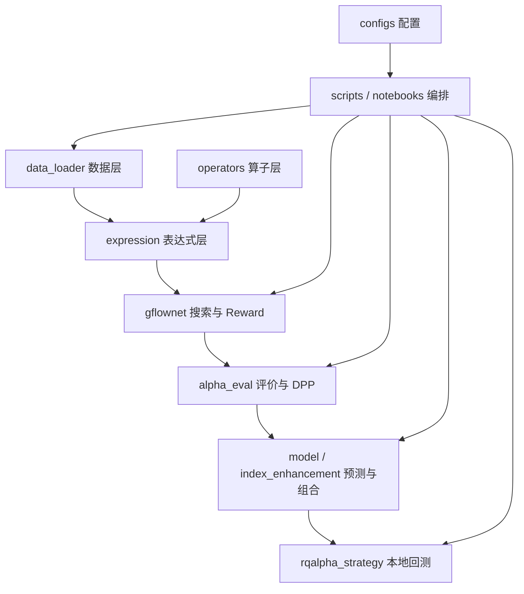

# 项目架构

## 设计边界

项目把“数据访问、表达式语义、搜索训练、因子筛选、预测融合、组合回测”分为独立层。正式算法位于 `src/`，命令行脚本和 Notebook 只负责传入配置与编排。RQAlphaPlus 单独放在 `rqalpha_strategy/`，使无授权的 Colab/PPU 环境也能完成模型训练。

依赖应沿箭头单向流动。核心模块不应导入 Notebook，也不应依赖用户绝对路径。

## 核心模块

### `src/data_loader`

- `preprocess.py`：日频字段映射、清洗、复权与截面标准化；
- `dolphindb_minute.py`：DDB 配置、分区查询、交易日和字段审计；
- `minute_dense.py`：单交易日分钟表转稠密 NumPy 通道；
- `minute_memmap.py`：MemMap 构建、读取及全量 RAM store；
- `minute_ram_cache.py`：PPU RAM 快照指纹、原子写入和数组校验；
- `minute_quality_audit.py`：241 根分钟网格与异常日审计。

### `src/expression` 与 `src/operators`

`expression` 定义可序列化的表达式树、分钟文法和 DDB 编译器；`operators` 实现日频 Pandas、日频 PyTorch GPU 和分钟 NumPy 算子。表达式只描述“算什么”，执行后端决定“在哪里算”。

### `src/gflownet`

`model.py` 是 Transformer 策略网络；`grammar.py` 与 `minute_grammar.py` 产生合法动作；`trainer.py` 执行采样和 Trajectory Balance；`reward.py`、`minute_reward.py`、`memmap_reward.py` 计算金融 Reward；`factor_pool.py` 系列保存表达式和因子矩阵。

### `src/alpha_eval` 与 `src/model`

AlphaEval 计算 IC、ICIR、滚动稳定性、扰动鲁棒性、表达式逻辑分和 DPP 多样性。LightGBM 使用带 purge 的滚动训练，只向未来预测窗口输出股票分数。

### `src/index_enhancement`

负责三指数历史成分/权重、指数内标签、模型实验、因子归因、负超额诊断以及带基准权重约束的组合优化。外部 RQData 只在下载成分、权重和研究数据时调用，建模与回测读取本地文件。

### `rqalpha_strategy`

只包含 RQAlphaPlus 策略与启动器。回测在本地授权环境运行，不属于训练依赖，也不自行实现撮合引擎。

## 运行时边界

| 环境 | 主要任务 | 不执行 |
|---|---|---|
| Colab A100 | 日频 GFlowNet、AlphaEval、LightGBM、产物导出 | RQAlphaPlus 回测 |
| CPU 训练机 | 快速验证、分钟 MemMap GFlowNet | 外部行情下载 |
| 阿里 PPU | DDB 全量加载、磁盘快照、全量 RAM 训练 | CUDA 训练 |
| 本地 RQAlphaPlus | 指数数据下载、策略回测、报告 | GFlowNet 正式训练 |

## 持久化边界

配置和代码进入 Git；行情、DDB 快照、MemMap、模型、日志和完整实验结果由 `.gitignore` 排除。新模块优先输出到 `outputs/`，但已有 `results/`、`checkpoints/`、`experiments/` 暂时保留，以避免破坏训练和 Notebook 的兼容路径。
