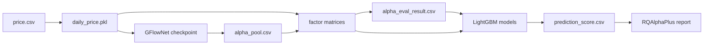

# 端到端工作流

## 日频流水线

日频流水线有两个等价编排环境：Colab A100 使用
`notebooks/pipelines/daily_colab_a100.ipynb`；本地 CPU 使用
`scripts/train_daily_local.py` 或 `notebooks/pipelines/daily_local_cpu.ipynb`。
二者共享表达式、Reward、AlphaEval、LightGBM 和标签实现，但使用独立配置与输出目录。

| 阶段 | 输入 | 主要工作 | 输出 |
|---|---|---|---|
| 1. 数据准备 | `data/price.csv` | 字段映射、排序、缺失/异常处理、可选复权、截面标准化 | `data/daily_price.pkl`、数据质量报告 |
| 2. 表达式搜索 | 2020–2023 日频行情、日频 Grammar | Transformer 采样表达式，执行因子并计算 TB Reward | `checkpoints/gflownet_best.pt`、训练日志 |
| 3. 因子池 | 最优检查点、完整 2020–2026 行情 | 生成表达式，拒绝重复和低覆盖因子，重算样本内外值 | `alpha_pool.csv`、两个 factor matrix |
| 4. AlphaEval | 样本内因子、未来收益标签 | IC/ICIR、稳定性、鲁棒性、逻辑、DPP | `alpha_eval_result.csv`、选中因子名 |
| 5. LightGBM | 选中因子、`t+5/t+1` 标签、历史 Universe | 带 5 日 purge 的 walk-forward 训练与预测 | 模型文件、`prediction_score.csv`、指标 |
| 6. 本地回测 | 2024–2026 预测分数、RQAlphaPlus bundle | 每 5 日调仓、排名平滑、缓冲和换手约束 | 净值、交易、持仓、绩效及生效配置 |

`alpha_factor_matrix.pkl` 是训练区间的因子值；`alpha_factor_matrix_oos.pkl` 是从相同已挖掘表达式在样本外行情上重新执行得到的值，不需要从 Colab 下载才能“重训表达式”，但本地若要直接建模或分析则需要相应因子数据或重新计算能力。

## 分钟频 DDB/MemMap 流水线

1. `prepare_ddb_minute.py --audit-only` 只审计表结构、日期覆盖和复权口径；
2. `audit_ddb_minute_quality.py --scope grid` 检查异常分钟、重复和 241 根网格；
3. `build_ddb_memmap.py` 按交易日查询 DDB，构建 19 个 `float32` 通道及有效掩码；
4. 训练期从本地 MemMap 读取表达式所需通道，NumPy 执行日内算子，Reduce 为日频因子；
5. 日频因子与未来收益计算 RankIC、LongIR、风险与覆盖率惩罚；
6. GFlowNet 通过 TB loss 更新策略网络并输出分钟 Alpha 池。

分离模式下，第 3 步完成后训练不再访问 DDB。PPU RAM 模式不使用 MemMap：首次从 DDB 加载全部数据进入内存并保存 NPY 快照；后续先校验配置指纹，命中后从本地快照全量恢复到内存。日频聚合数据另存为 `results/minute_ppu_ddb_ram/daily_price.pkl`，不依赖大型 RAM 快照；旧训练缺少该文件时可用 `scripts/export_ddb_daily.py` 单独补建，无需重训 GFlowNet。

## 指数增强流水线

1. `universe` 保存历史时点成分股；
2. `weights` 保存指数权重；
3. `labels` 在成分股内计算股票收益、指数加权收益、超额收益和涨跌停可交易标签；
4. `builder` 对沪深 300、中证 500、中证 1000 分别训练模型并输出分数；
5. 组合优化围绕基准权重求解，在行业、个股偏离、换手等约束下最大化预测收益；
6. RQAlphaPlus 使用同一冻结配置和万 8 费用回测。

## 时点和防泄漏规则

- 标签为 `close(t+5) / close(t+1) - 1`，信号与实际交易至少隔一个交易日；
- 训练与预测之间设置与标签跨度一致的 purge；
- Universe 和权重必须使用当时可得的历史文件，不能用当前成分回填过去；
- 因子公式只能访问当前和过去数据；
- 回测只读取 `signal_date < trade_date` 的最近信号；
- 涨跌停限制同时进入可交易标签/样本权重和本地撮合约束。
